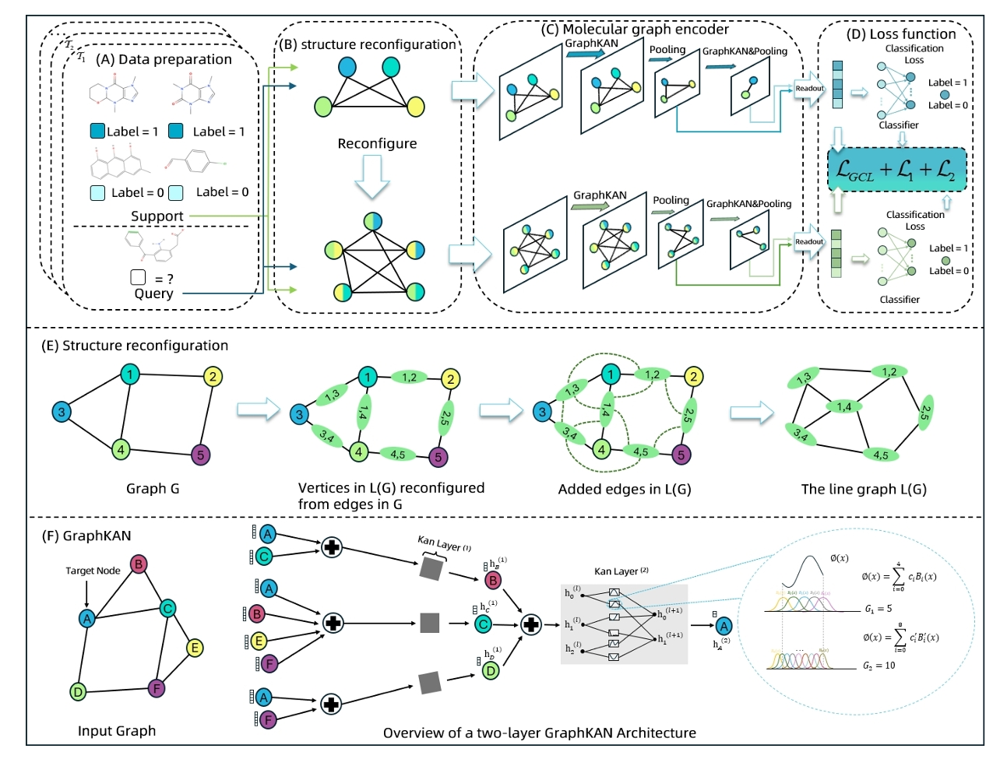

# :rocket: Model Architecture

# :memo: Dataset Download

We have provided the datasets in the "data" folder.


## Create environment
```
conda env create -f environment.yaml
```

## Create Dataset

The original datasets are downloaded from [Data](http://snap.stanford.edu/gnn-pretrain/data/chem_dataset.zip). We utilize data/splitdata.py to split the datasets according to the molecular properties and save them in different files in the data/[DatasetName]/new.

```python
cd data && python splitdata.py
```

## Training 
```
python train_fewshot.py
```


## Reference
1. We use the code from project [Meta-MGNN](https://github.com/zhichunguo/Meta-MGNN) and [MolFeSCue](https://github.com/zhangruochi/MolFeSCue/tree/master). Thanks for their contribution.


